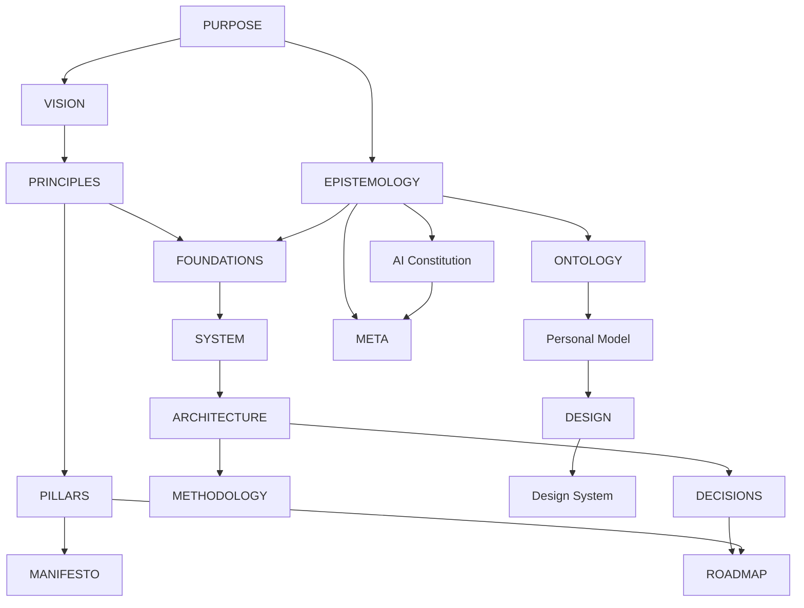

# Architecture Document System

This directory is Aether's canonical contract for selecting, authoring,
materializing, relating, and validating architecture documents across Ego
Hygiene repositories.

## Artifact layers

1. `document.spec.md` defines the common specification and materialized-document
   contract.
2. Category directories define the concern owned by each document.
3. `set.spec.md` defines how a repository selects and governs an applicable
   document set.
4. `architecture-document.schema.json` validates materialized frontmatter after
   YAML extraction.
5. `validate.py` validates a consumer repository's metadata, Markdown shape,
   relationships, links, graph, and `META.md` inventory.

Specifications are reusable. Uppercase root documents such as `PURPOSE.md` and
`ARCHITECTURE.md` are repository-specific materializations.

## Categories and documents

| Category | Documents |
| --- | --- |
| Identity | `PURPOSE.md`, `VISION.md`, `PRINCIPLES.md`, `PILLARS.md`, `MANIFESTO.md` |
| Meta | `EPISTEMOLOGY.md`, `AI_CONSTITUTION.md`, `META.md` |
| Domain | `ONTOLOGY.md`, `PERSONAL_MODEL.md` |
| Foundation | `FOUNDATIONS.md`, `SYSTEM.md`, `ARCHITECTURE.md`, `METHODOLOGY.md`, `ROADMAP.md` |
| Experience | `DESIGN.md`, `DESIGN_SYSTEM.md` |
| Governance | `DECISIONS.md` |

## Selection profiles

Profiles are applicability guidance, not fixed bundles:

- **Core:** purpose, vision, principles, epistemology, foundations, system,
  architecture, methodology, decisions, roadmap, and meta.
- **Human-facing:** core plus personal model, design, and design system.
- **AI-participating:** core plus AI constitution.
- **Domain-rich:** core plus ontology.
- **Public identity:** core plus pillars and manifesto.
- **Complete reference:** all 18 documents when the repository genuinely has
  domain, human, AI, governance, experience, and public-identity concerns.

A repository may compose profiles or select documents individually. It must not
create empty placeholders merely to match a profile. `META.md` records every
intentional omission and every missing or blocked dependency.

## Default authoring sequence



Artifact metadata remains authoritative for the actual dependency graph.

## Materialization rules

- Use the exact canonical uppercase filename for each selected document.
- Place canonical materializations at repository root unless an accepted local
  decision establishes another discoverable layout.
- Use `schema: aether.architecture-document/v1` and
  `kind: architecture-document`.
- Prefix artifact identifiers with a stable repository or product identifier.
- Reference artifact identifiers, not file paths, in dependency metadata.
- Preserve one H1, valid heading progression, labeled uncertainty, and stable
  relative links.
- Treat generated portals and diagrams as projections of the Markdown corpus.

## Validation

From Aether, validate any checked-out consumer repository:

```bash
python3 library/organization/specs/architecture/validate.py \
  --repository "/path/to/repository"
```

The validator discovers canonical materializations at repository root and in a
categorized `docs/architecture/**` layout. When both locations contain the
same canonical filename, the categorized document is authoritative and the
root file is treated as a navigation surface.

Use `--require-complete-reference` only for repositories that intentionally
adopt all 18 documents.
